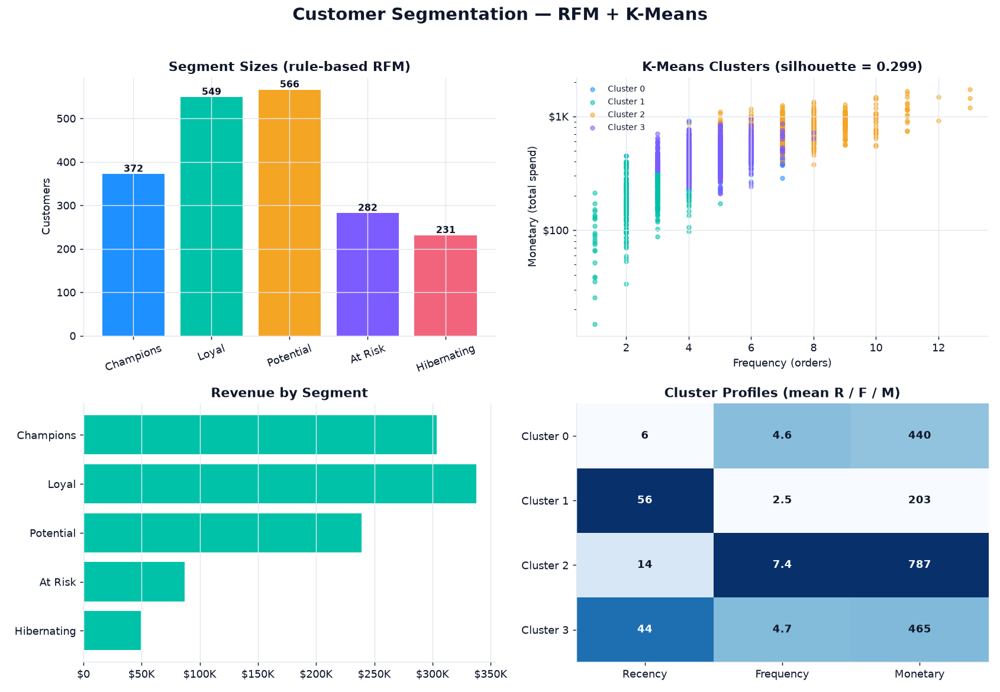

# 🎯 Customer Segmentation — RFM + K-Means

> Segments a customer base two complementary ways — an interpretable **RFM**
> quintile model that marketing can act on by name, and an unsupervised
> **K-Means** clustering validated by silhouette — so retention and growth spend
> goes where the value is.

<p>
  
  
  
  
  
  
</p>

---

## 📊 Segmentation dashboard

Generated by `src/rfm.py` from 10,165 transactions across 2,000 customers:



---

## Why this project

Not all customers are worth the same marketing dollar, and treating them as if
they are wastes budget at both ends — over-discounting loyalists who'd have
stayed, and ignoring high-value accounts drifting toward churn. This project
answers *"who are my customers, really?"* two ways that cross-check each other: a
**rule-based RFM model** that produces named, explainable segments a campaign can
target tomorrow, and a **K-Means clustering** that finds the natural groupings in
the data without any hand-set thresholds. Where the two agree, you can act with
confidence.

## What it does

| Stage | File | Output |
|---|---|---|
| **Generate** synthetic transaction history (Poisson order counts, exponential recency, gamma spend) | `src/generate_data.py` | `data/transactions.csv` |
| **Score** each customer on Recency / Frequency / Monetary quintiles (1–5) | `src/rfm.py → build_rfm()` | R, F, M, `rfm_score` |
| **Label** into Champions → Hibernating from the composite score | `src/rfm.py → label()` | `segment` |
| **Cluster** with K-Means on log-scaled RFM; validate with silhouette | `src/rfm.py → cluster()` | `cluster`, silhouette |
| **Report** metrics + a one-page dashboard | `src/rfm.py → dashboard()` | `outputs/*` , `docs/*` |
| **Verify** scoring and clustering invariants | `tests/test_rfm.py` | `pytest` |

## 📈 Latest run (deterministic — seeded RNG)

| Metric | Value |
|---|---|
| Customers | 2,000 |
| Transactions | 10,165 |
| Avg. orders / customer | 5.08 |
| Total monetary value | **$1,016,378** |
| K-Means clusters (k) | 4 |
| **Silhouette score** | **0.299** |
| Champions | **18.6% of customers → 29.9% of revenue** |

> Full machine-readable metrics: [`docs/metrics.json`](docs/metrics.json).
> Sample scored customers: [`docs/sample_segments.csv`](docs/sample_segments.csv).

## 🔍 What the segments say

**RFM segment mix** (2,000 customers):

| Segment | Customers | Revenue |
|---|---|---|
| Champions | 372 | $303,586 |
| Loyal | 549 | $337,436 |
| Potential | 566 | $239,041 |
| At Risk | 282 | $86,772 |
| Hibernating | 231 | $49,543 |

Champions are only **18.6% of the base but 29.9% of revenue** — the classic
value-concentration signal that justifies a dedicated retention track. At the
other end, *At Risk* + *Hibernating* are 25.6% of customers but just 13.4% of
revenue: worth a low-cost win-back, not premium spend.

**K-Means cluster profiles** (mean values, silhouette 0.299):

| Cluster | Recency (days) | Frequency | Monetary |
|---|---|---|---|
| 0 | 6.0 | 4.6 | $440 |
| 1 | 55.6 | 2.5 | $203 |
| 2 | 13.7 | 7.4 | $787 |
| 3 | 43.7 | 4.7 | $465 |

Cluster 2 is the unsupervised echo of the Champions segment — recent, frequent,
high-spend — found without any hand-set score thresholds. Cluster 1 (lapsed,
low-value) mirrors the At Risk / Hibernating tail.

## Methodology

- **RFM** — customers are scored into 1–5 quintiles on each of recency (reversed:
  recent = 5), frequency, and monetary. The composite `rfm_score` (3–15) maps to
  five named segments via fixed, documented thresholds — fully interpretable, no
  black box.
- **K-Means** — features are `log1p`-transformed (RFM distributions are heavily
  right-skewed) then standardised, so no single dimension dominates the Euclidean
  distance. `k=4`, `n_init=10`, `random_state=42`. **Silhouette (0.299)** confirms
  the clusters are real structure, not partitioned noise.
- **Reproducible** — `numpy` RNG seeded at 23 (data), K-Means seeded at 42.

## ▶️ Run it

```bash
pip install -r requirements.txt
python src/generate_data.py   # writes data/transactions.csv (~10.2k rows)
python src/rfm.py             # prints segments + clusters, writes outputs/ + docs/
pytest -q                     # 6 tests
```

## 🧪 Tests

`tests/test_rfm.py` guards: the transaction schema and positive amounts, R/F/M
quintiles bounded to 1–5 and `rfm_score` to 3–15, the exact `label()` threshold
boundaries, that segment labels are **score-monotonic** (mean RFM score strictly
decreases Champions → Hibernating), that K-Means returns exactly `k` clusters
with a **valid, positive silhouette**, and that the metric aggregates reconcile
(segment sizes sum to the customer count, segment revenue sums to the total).

## 🗂️ Project structure

```
customer-segmentation-rfm/
├── src/
│   ├── generate_data.py   # synthetic transaction generator (seeded)
│   └── rfm.py             # RFM scoring + K-Means + silhouette + dashboard
├── tests/
│   └── test_rfm.py        # pytest invariants
├── docs/                  # committed dashboard, cluster plot, metrics, sample
├── requirements.txt
└── README.md
```

## 🛠️ Stack

`scikit-learn` (KMeans, StandardScaler, silhouette) · `pandas` · `numpy` · `matplotlib` · `pytest`

---

<sub>Part of my data & analytics portfolio — [github.com/syedjawaadali](https://github.com/syedjawaadali). Data is synthetic; no real customer information is used.</sub>
